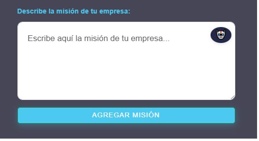
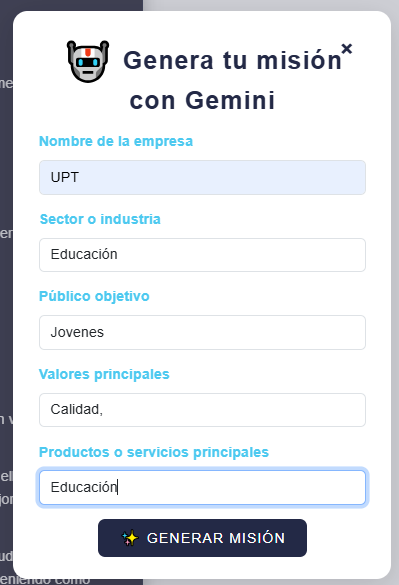
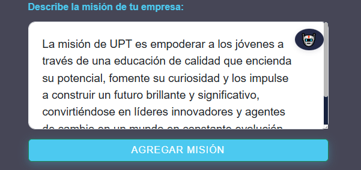
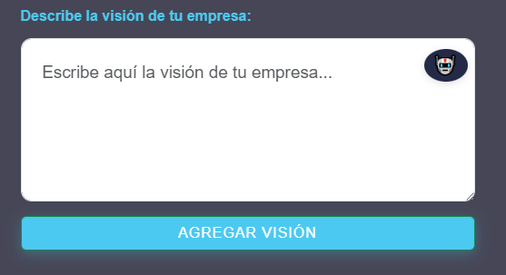
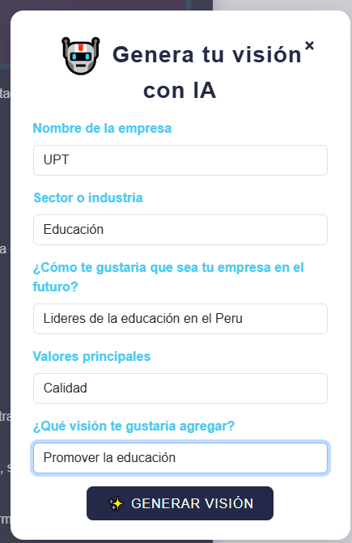
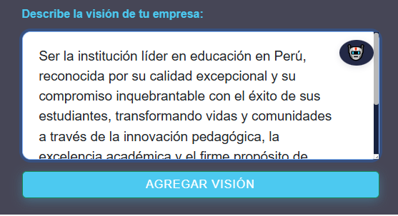

# PE_II_EXAMEN_PRACTICO# Examen Práctica Unidad II - PETI  
**Erick Yoel Ayma Choque**  
**28/05/25**

**URL DE REPOSITORIO:**  
https://github.com/ea2021072616/PE_II_EXAMEN_PRACTICO.git

---

## Vista: Misión (`index.php`)

### Botón de IA junto al campo de misión
- Se agrego un botón 🤖 para generar misión con IA aparece al costado derecho del textarea, dentro del formulario manual.
- El botón tiene un diseño discreto y profesional, alineado con el campo de texto.

### Mejora visual del textarea
- El campo de texto para la misión (`textarea`) ahora es más grande y cómodo, con mayor altura, padding y fuente más legible.
- 

### Modal para generación de misión con IA
- El modal para la IA se mantiene, permitiendo al usuario ingresar datos clave (nombre, sector, público, valores, productos).
- El prompt enviado a la IA fue mejorado para que la misión generada sea profesional, inspiradora y adaptada al sector este promt fue estructurado y planeado para este objetivo.
- El inicio de la misión se define dinámicamente según el sector (ejemplo: “La misión de [nombre] es…”).
- 

### Código y estilos
- Se eliminaron los estilos y el HTML del botón flotante que ya no se usa.
- El botón de IA junto al textarea mantiene un diseño consistente con el resto de la interfaz.
- 

---

## Vista: Visión (`index.php`)

### Botón de IA junto al campo de visión
- Se agregó un botón 🤖 al costado derecho del textarea para generar la visión con IA, igual que en la vista de misión.
- El botón abre un modal para ingresar los datos necesarios para la generación automática.

### Mejora visual del textarea
- El campo de texto para la visión (`textarea`) también se amplió y mejoró visualmente para mayor comodidad y claridad.

### Modal para generación de visión con IA
- El modal solicita nombre de la empresa, sector, futuro deseado, valores y ahora también una frase o idea que el usuario quiera agregar a la visión.
- El prompt para la IA fue ajustado para incluir todos estos datos y generar una visión alineada a lo solicitado y adaptada al sector este promt fue estructurado y planeado para este objetivo.

### Código y estilos
- El diseño y la experiencia de usuario son consistentes con la vista de misión.
- El botón de IA y el modal mantienen el mismo estilo profesional y moderno.
  

---

## En conclusion

Ambas vistas ahora cuentan con un botón de IA junto al campo de texto principal, un modal para la generación automática y mejoras visuales en los campos de entrada, eliminando elementos redundantes y asegurando una experiencia de usuario clara y profesional.
